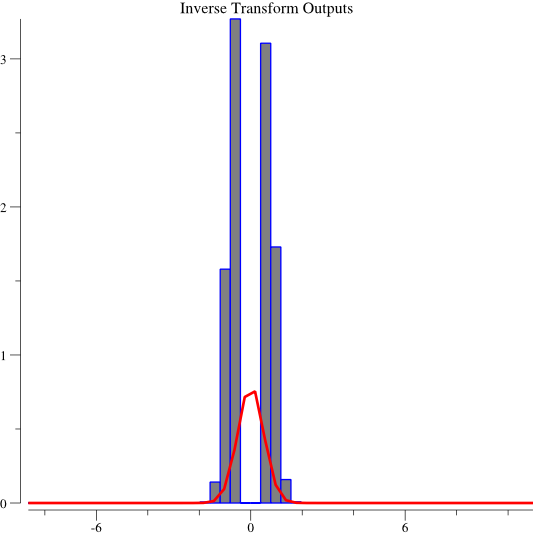
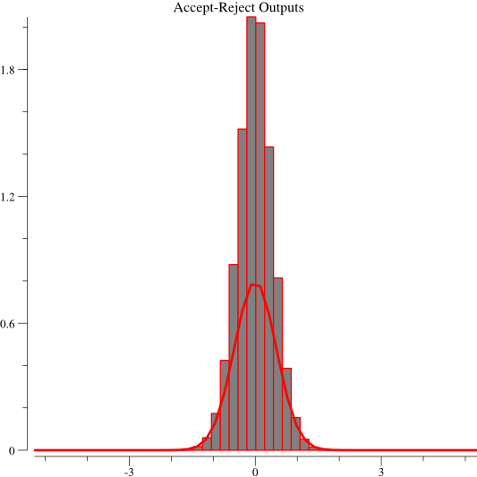

# Introduction

This report was written by Robbie McKinstry on March 6, 2016. You can find the full source code used in the report, as well as a version controlled history, at [https://github.com/RobbieMcKinstry/StandardNormal](https://github.com/RobbieMcKinstry/StandardNormal).

# Installation:

Note: these instructions are the same as included for Homework 2. You do not need to repeat most of them, with the exceptions listed below.

First, [download the Golang compiler](https://golang.org/dl/), at least version 1.5.
Next follow the [installation instructions](https://golang.org/doc/install). Note, that to successfully compile this source, you need to establish a Go workspace. This is a directory that contains the subdirectories `src`, `bin`, and `pkg`.
Then, set the environment variable GOVENDOREXPERIMENT to 1. (You should also set the GOPATH variable as per the installation instructions.

    GOVENDOREXPERIMENT=1
    GOPATH=$HOME/go-workspace # done during the installation process

Now, recall that this directory needs to be located in the Go Path at a specific location so that the compiler can find the dependency packages. One option (not preferred) is to move this directory to `$GOPATH/github.com/RobbieMcKinstry/StandardNormal`.

Instead, you should use the built in Go tool, `go get`. Run `go get github.com/RobbieMcKinstry/StandardNormal`. This will successfully pull down a copy of this repo into the correct location in the Go path. `cd` into that directory.

`cd $GOPATH/github.com/RobbieMcKinstry/UniformRandom`.

Then, you can successfully compile and execute the source. `go run main.go`, or alternatively, `go build main.go`

Additionally, make sure you run `go get github.com/gonum/plot`. This is necessarily for generating the histograms again.

You will also need a copy of my previous package, `UniformRandom`, to replicate my Chi Squared test. Run `go get github.com/RobbieMcKinstry/UniformRandom`. It's possible that the `/vendor` directory will already have a copy, but you might want to run it again just to be sure. 

# Disclaimer

This is a package for implementing 3 different methods of statistically modeling the standard normal distribution.

The license for this project is the standard MIT License, with the amendation that the intellectual property represented by this repository is in the sole possession of Robbie McKinstry, and that students enrolled in the University of Pittsburgh's Introduction to Simulation Computer Science class ( CS 1538) are not permitted to copy, reproduce, replicate, or use this repository in any manner. Any violating is illegal, and as such I am not responsible for any plagerism resulting from unauthorized and illegal usage of this repository.

# Experiment Set Up

Each experiment was run on a 4 core Macbook, running El Capitan 10.11.3
The Macbook was produced in Early 2013, has a 2.4 GHz Intel Core i7 processor, with 8GB memory.

For the inverse transform method, first the inverse function was analytically solved (see below for the derivation), before coding began. The inverse formula produces half of the number line (all values less than and equal to 0), so a method was applied (called `CoinFlip`) to generate the second half of the number line. THe `CoinFlip` approach randomly flipped the sign of the resultant value 50% of the time, since half of the values should be negative, while the other half positive. This same approach was applied to the Accept Reject method for the same reason.

Benchmarking was done using the Go standard library's built in benchmarking suite. More information on how the benchmarking suite works can be found in the [Go documentation](https://golang.org/pkg/testing/#pkg-overview). In short, the Go test runner determines how many times it needs to run the function being tested in order to determine how long it takes. This removes variablility from CPU load and garbage collection from affecting results.

# Predictions

Prior to running the test, I expected the special properties method to preform the fastest, because it produces two values every other time it's called, and returns the cached value on the following call. Thus, since it produces two values instead of one, it should be much faster than other apporaches, though probably not by a factor of 2, since the mathematical operations it performs are slow.

I expected the Accept-Reject method take the most amount of time, since it has a probabilistic run time, and thus is subject to highly variable runtimes. I believed that on aggregate, outliers would not drag down the average runtime since I believe the Golang benchmarking suite controls for outliers, but the occasional trial with a large number of rejects would cause the test to be slower than the inverse transform method. I predicted the inverse transform method to be relatively speedy since it occurs in O(1), like the special properties approach.

# Results

To repeat the results, `cd stdnormal`, then run `go test -short -bench .`

    BenchmarkInverseTransform-8     20000000                68.2 ns/op
    BenchmarkAcceptReject-8         10000000                133 ns/op
    BenchmarkSpecialProperties-8    30000000                51.3 ns/op

Above, the second column represents the number of times the function had to run to be profiled. The third column indicates the number of nanoseconds per function call (op stands for operations). As you can see, the Special Properties approach was fastest, while the Inverse Transform approach was slower than the Special Properties approach but signficantly faster than the Accept Reject approach.

Accept-Reject was almost twice as slow as the other approaches, and more consistent, as indicated by the number of trials. Special Properties handily beat out the Inverse Transform method. My predictions were all correct, though I did say I didn't expect Accept-Reject to be twice as slow as Inverse Transform.

Next, I counted the average number of rejects for the Accept-Reject approach. This was performed as a seperate test, since I noticed that keeping a running total of rejects was affecting the results of the benchmark.

Because the benchmarking functions are run multiple times by the the Golang profiler, multiple averages are generated, without a mention of their indivual weights. While this could be easily calculated by printing out the values of `b.N` for each test, because the averages were so consistent, I found no reason to do so. The results were consistently reported that it took `1.1` attempts before finding a match. This indicats that one out of every ten values was rejected, approximately.

Following generating the above results, I began creation of the histograms. The program used to create the histograms can be found in `main.go`. Remember, running the program will override the histograms included as part of this package.

The histograms were automatically generated using a Go library. You can see them enclosed, or you can generate them yourself using `go run main.go`. Again, you need to have installed all of the dependencies correctly for this to work.

The histograms all indicate that the methods functioned approperately, having produced a result that very much looks like the standard normal distribution. However, there appears to be a __divide by zero__ problem with displaying the histogram for the inverse transform method. While my results are consistent with expected values, something appears amiss with visualize them.

Each of the histograms was graphed with a curve indicating the value of the standard normal curve at that point. The bars represent how many values were encountered, after normalization. The curve just gives a good idea of expected density at each point. 

# Chi Squared

I used my own package for the Chi Squared test, found at `github.com/RobbieMcKinstry/UniformRandom`.
After running against a reduced subset histogram data, I produced the following results:

Inverse Transform: 13.785

Accept Reject: Test statistic = 10.028

Special Properties: 15.011

These results indicate that there was not a significant difference between the expected output and the observed output. I failed to reject the null hypothesis, indicating that the methods are effective.

# Derivation of Formula for the inverse transform method

Give by Professor Lipschultz:
Pr(Z <= x ) = 1 / (1 + e^(-1.702x))

Let y = Pr

Then,

y = 1 / (1 + e^(-1.702x))

Let x = y and y = x, for calculation of the inverse function.

x = 1 / (1 + e^(-1.702y))

Now, sovle for y in terms of x.

x(1 + e^(-1.702 y)) = 1

ln x + ln(e^(-1.702y)) = 1

-1.702y = 1 - ln x

y = (1 - ln x) / -1.702

This formula describes the displacement from the origin, y in temrs of the cumulative distribution (area under the graph), x.
So, if you generate a number from [0, 1), then you have generated the cumulative distribution for the standard normal curve. After applying this inverse function and solving for y ( y = (1 - ln x) / -1.702 ), you then have the y = to the point along the x axis where your cumulative distribution occurs.

